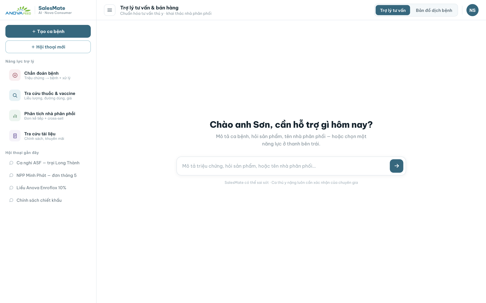
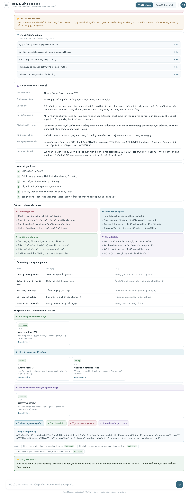
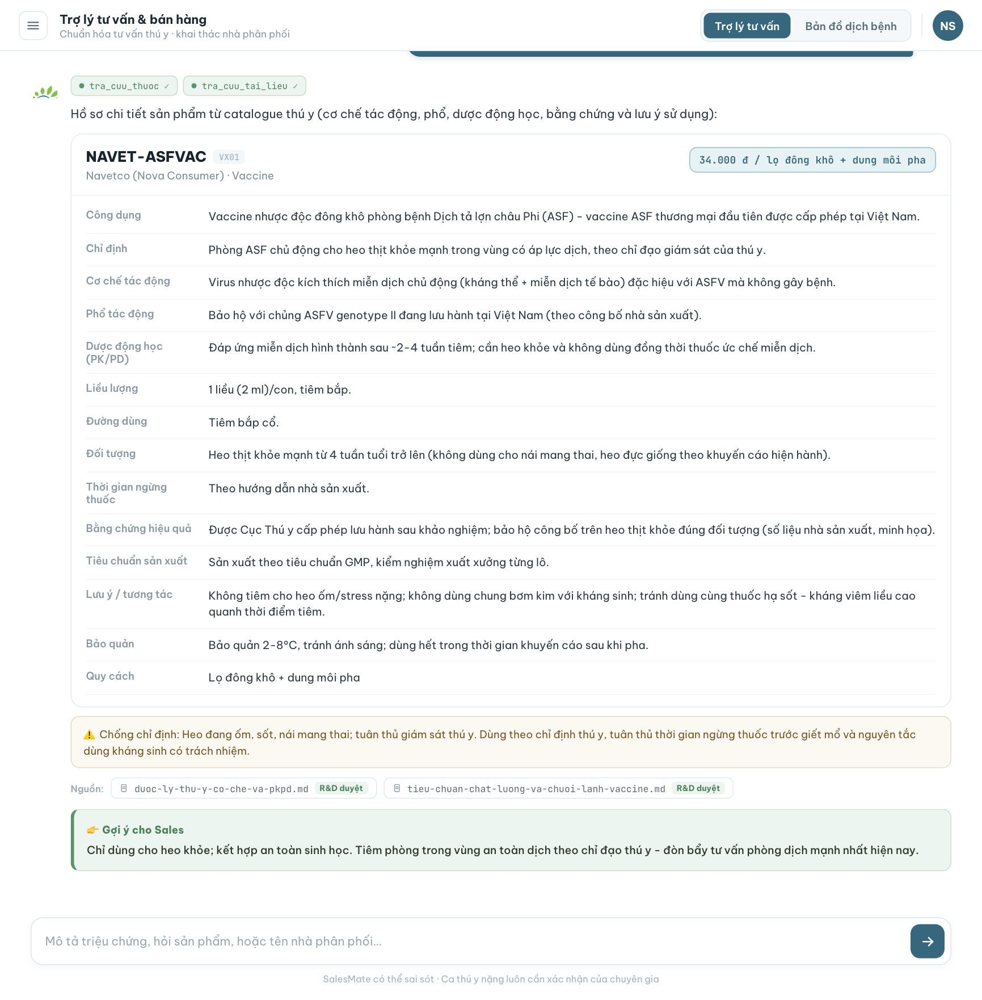
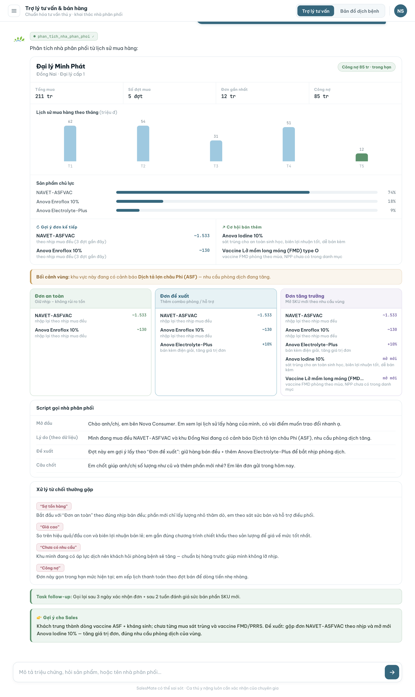
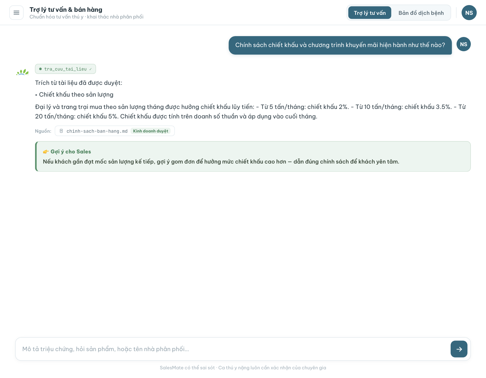
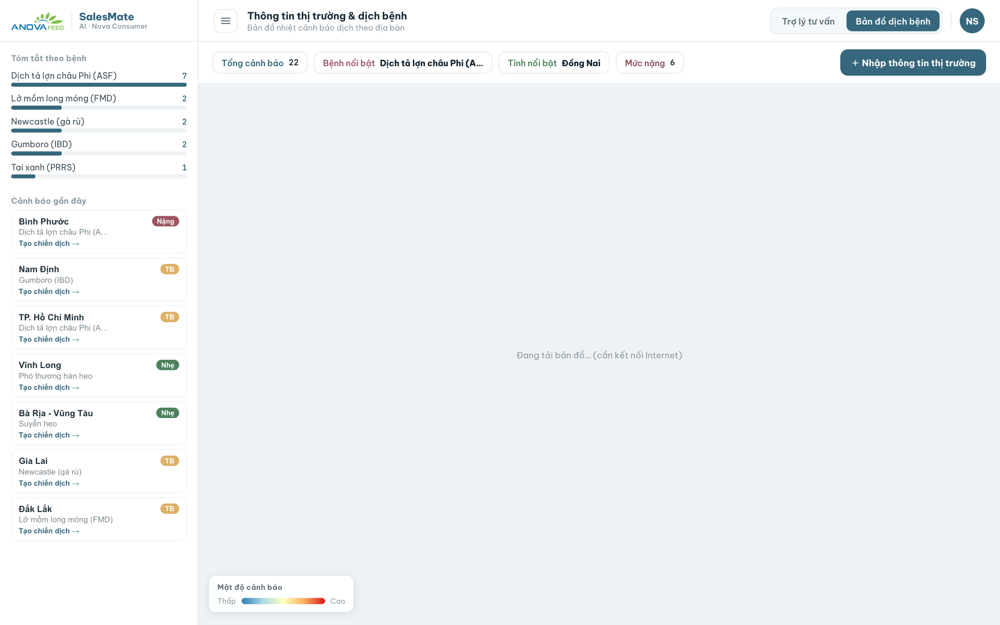
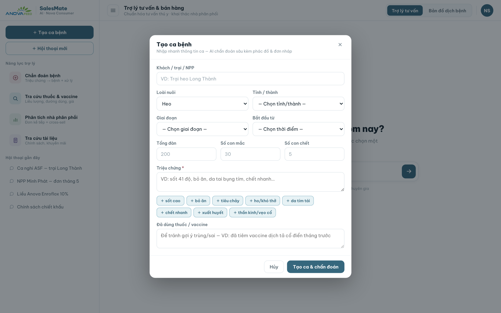
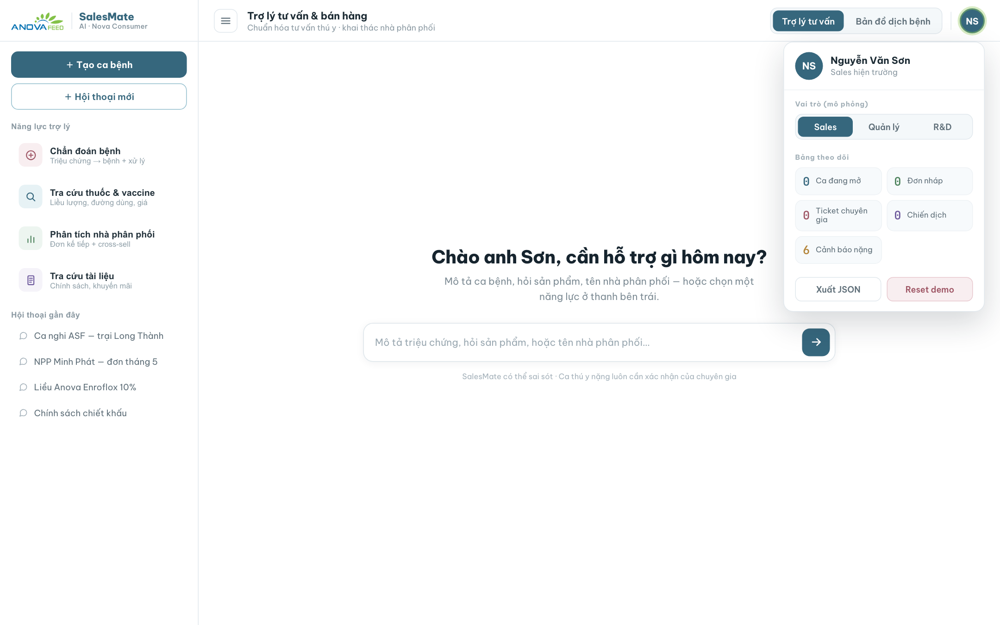

# AI SalesMate — Trợ lý tư vấn & bán hàng thú y

Trợ lý AI cho **đội ngũ Sale thuốc thú y của Nova Consumer (Anova)**. Gom mọi việc mà nhân viên kinh doanh cần khi đứng trước khách hàng (trại chăn nuôi, đại lý) vào **một giao diện hội thoại duy nhất**: chẩn đoán bệnh, tra cứu thuốc/vaccine, phân tích nhà phân phối, tra cứu tài liệu nội bộ, và bản đồ cảnh báo dịch bệnh — mỗi câu trả lời đều kèm **gợi ý bán hàng**.



> Bản web này là **bản trình diễn tĩnh**: chạy 100% trong trình duyệt, dùng dữ liệu mẫu, **không gọi LLM thật** nên deploy 0đ, không tốn API key. Bản gọi LLM thật (Streamlit + GLM qua FPT Cloud) nằm trong [ver/salemate-ver/](ver/salemate-ver/).

---

## Mục lục
1. [Mục đích](#1-mục-đích)
2. [Các tính năng & dùng để làm gì](#2-các-tính-năng--dùng-để-làm-gì)
3. [Dữ liệu](#3-dữ-liệu)
4. [Công nghệ & kiến trúc](#4-công-nghệ--kiến-trúc)
5. [Cấu trúc thư mục](#5-cấu-trúc-thư-mục)
6. [Chạy & triển khai](#6-chạy--triển-khai)
7. [Lưu ý](#7-lưu-ý)

---

## 1. Mục đích

Khi tư vấn, nhân viên Sale phải trả lời rất nhanh nhiều câu hỏi đan xen: *con này bệnh gì, dùng thuốc nào, liều bao nhiêu, giá sao, đại lý này nên chào đơn gì, chính sách chiết khấu thế nào…*. AI SalesMate giúp:

- **Trả lời chuẩn & có dẫn nguồn** — dựa trên cơ sở dữ liệu bệnh, sản phẩm và tài liệu nội bộ đã duyệt.
- **Chuẩn hoá quy trình tư vấn** — từ triệu chứng → bệnh → phác đồ → sản phẩm gợi ý → đơn nháp.
- **Khai thác nhà phân phối** — phân tích lịch sử đơn, gợi ý đơn kế tiếp và cơ hội bán thêm.
- **Bán đúng thời điểm** — bản đồ cảnh báo dịch giúp ưu tiên vùng đang "nóng".

Đối tượng dùng: **nhân viên kinh doanh / tư vấn kỹ thuật** của Nova Consumer.

---

## 2. Các tính năng & dùng để làm gì

Ứng dụng có **2 không gian**, chuyển qua lại bằng tab trên đầu màn hình: **Trợ lý tư vấn** (chat) và **Bản đồ dịch bệnh**.

### 2.1. Chẩn đoán bệnh
**Dùng để:** từ mô tả triệu chứng của khách → suy ra bệnh khả năng cao nhất và hướng xử lý, để Sale tư vấn ngay tại chỗ.

Kết quả gồm: **độ tin cậy (%)**, tác nhân gây bệnh, **chẩn đoán phân biệt**, **mức rủi ro ca bệnh**, **chỉ số cảnh báo sớm**, **phác đồ xử lý theo bước** (cho trại nghi nhiễm và trại lân cận), **sản phẩm Nova Consumer nên dùng** (sát trùng / hỗ trợ / vaccine), và **cảnh báo "cần chuyên gia"** khi ca nặng. Có sẵn nút **Tính dự toán phác đồ, Tạo đơn nháp, Tạo ticket chuyên gia, Xuất tin nhắn gửi khách**.



### 2.2. Tra cứu thuốc & vaccine
**Dùng để:** tra nhanh thông tin một sản phẩm theo tên/mã khi khách hỏi "thuốc này dùng sao, liều bao nhiêu, giá thế nào".

Hiển thị đầy đủ: công dụng, chỉ định, **cơ chế tác động**, **liều lượng**, **đường dùng**, thời gian ngừng thuốc, bằng chứng/tiêu chuẩn, bảo quản, quy cách và **giá tham khảo** — kèm **nguồn dẫn**.



### 2.3. Phân tích nhà phân phối
**Dùng để:** chuẩn bị trước khi gọi/đi gặp một đại lý — biết nên chào đơn gì.

Phân tích lịch sử đơn của đại lý rồi đưa ra **gợi ý đơn kế tiếp**, **cơ hội bán thêm (cross-sell)** và **đơn nháp có thể Copy** để gửi khách.



### 2.4. Tra cứu tài liệu
**Dùng để:** trả lời các câu hỏi về **chính sách bán hàng, chương trình khuyến mãi, kỹ thuật chăn nuôi** dựa trên tài liệu nội bộ đã duyệt.

Trích đúng đoạn tài liệu, kèm **nguồn có nhãn duyệt** và gợi ý cách vận dụng khi chốt đơn.



### 2.5. Bản đồ dịch bệnh
**Dùng để:** nhìn tổng thể vùng nào đang có cảnh báo dịch để ưu tiên chào hàng phòng/trị bệnh.

Bản đồ nhiệt theo tỉnh + bảng **tóm tắt theo loại bệnh**, **danh sách cảnh báo gần đây** (kèm mức độ Nặng/TB/Nhẹ và nút **Tạo chiến dịch**), cùng bộ lọc nhanh (tổng cảnh báo, bệnh nổi bật, tỉnh nổi bật…). *(Nền bản đồ cần kết nối Internet — OpenStreetMap.)*



### 2.6. Tạo ca bệnh
**Dùng để:** nhập nhanh hồ sơ một ca (vật nuôi, tỉnh, giai đoạn, quy mô đàn, số con mắc/chết, triệu chứng, sản phẩm đã dùng) để AI chẩn đoán chính xác hơn. Có **chip triệu chứng** bấm nhanh. Ca được lưu vào **Ca bệnh gần đây** ở thanh bên.



### 2.7. Menu người dùng & tiện ích demo
**Dùng để:** điều chỉnh phiên demo. Gồm **Vai trò (mô phỏng)**, **Bảng theo dõi**, **Xuất JSON** (xuất dữ liệu demo) và **Reset demo** (xoá dữ liệu đã lưu).



### 2.8. Tiện ích chung
- **Ô chat tự do** — gõ triệu chứng / tên sản phẩm / tên đại lý, nhấn **Enter** để gửi.
- **Dấu vết công cụ** — mỗi câu trả lời hiển thị các "tool" đang được gọi (mô phỏng agent) rồi tới thẻ kết quả.
- **Gợi ý bán hàng** — luôn xuất hiện ở cuối mỗi câu trả lời.
- **Hội thoại mới / Ca bệnh gần đây / Hội thoại gần đây** — quản lý phiên làm việc (lưu bằng `localStorage`).
- **Thu/mở thanh bên** — mở rộng không gian xem nội dung.

---

## 3. Dữ liệu

Toàn bộ là file tĩnh trong [AI4Sales/data/](AI4Sales/data/):

| Tệp | Nội dung | Số bản ghi |
|---|---|---|
| `diseases.json` | Bệnh: triệu chứng, chẩn đoán phân biệt, mức độ, phác đồ, vaccine, sản phẩm liên quan… | 14 |
| `vet_products.json` | Thuốc/vaccine: liều, đường dùng, cơ chế, PK/PD, bằng chứng, giá… | 19 |
| `distributors.json` | Nhà phân phối: khu vực, quy mô, công nợ, lịch sử đơn | 4 |
| `market_alerts.json` | Cảnh báo dịch theo tỉnh + ngày | 22 |
| `provinces_vn.json` | 58 tỉnh kèm toạ độ (cho bản đồ) | 58 |
| `knowledge/*.md` | Tài liệu cho phần tra cứu: chính sách, khuyến mãi, kỹ thuật chăn nuôi, dược lý, an toàn sinh học… | 11 |

---

## 4. Công nghệ & kiến trúc

- **Web tĩnh thuần**: HTML + JavaScript + JSON, chạy 100% ở trình duyệt — **không backend, không API key, không tốn quota**.
- Giao diện build bằng framework nội bộ **"dc"** ([AI4Sales/support.js](AI4Sales/support.js)) trên nền **React 18** (tự nạp từ CDN khi mở trang).
- **Leaflet + leaflet.heat** cho bản đồ nhiệt.
- Câu trả lời **dựng từ dữ liệu mẫu (mock)** — *không gọi mô hình ngôn ngữ*; phần "đang suy nghĩ / gọi tool" là mô phỏng phục vụ trình diễn.
- Lưu trạng thái demo (ca bệnh, hội thoại) bằng `localStorage`.

---

## 5. Cấu trúc thư mục

```
AI4Sales-WebApp/
├── index.html              # Trang chờ có thương hiệu, tự chuyển vào app
├── AI4Sales/               # ★ Ứng dụng đang chạy
│   ├── AI SalesMate.dc.html   # Toàn bộ giao diện + logic
│   ├── support.js             # Runtime "dc"
│   ├── assets/                # Logo Anova
│   └── data/                  # diseases / products / distributors / alerts / provinces / knowledge
├── screenshots/            # Ảnh màn hình dùng cho README
├── docs/                   # Tài liệu dự án (tổng quan, kế hoạch, kịch bản demo, hướng dẫn)
└── ver/                    # Kho các phiên bản trước (Streamlit, html-ver, ai4sale-1-ver)
```

---

## 6. Chạy & triển khai

### Chạy thử ở máy
App đọc dữ liệu qua `fetch` nên cần chạy qua HTTP server (không mở trực tiếp `file://`):

```bash
cd "AI4Sales-WebApp"
python3 -m http.server 8000
# Mở http://localhost:8000  → trang chờ tự chuyển vào app
```

### Triển khai công khai (miễn phí)
Deploy lên **GitHub Pages** — xem hướng dẫn: [docs/md/06-trien-khai/DEPLOY-GitHub-Pages.md](docs/md/06-trien-khai/DEPLOY-GitHub-Pages.md).

---

## 7. Lưu ý

- Đây là **bản demo dùng dữ liệu mẫu** — số liệu (giá, công nợ, cảnh báo…) chỉ để minh hoạ.
- AI SalesMate **hỗ trợ** chứ không thay thế chuyên môn: **ca thú y nặng luôn cần chuyên gia xác nhận** trước khi dùng thuốc.
```
